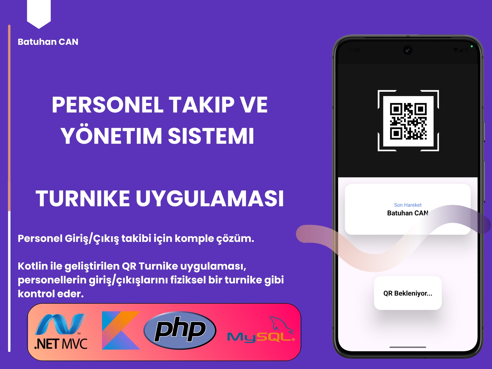
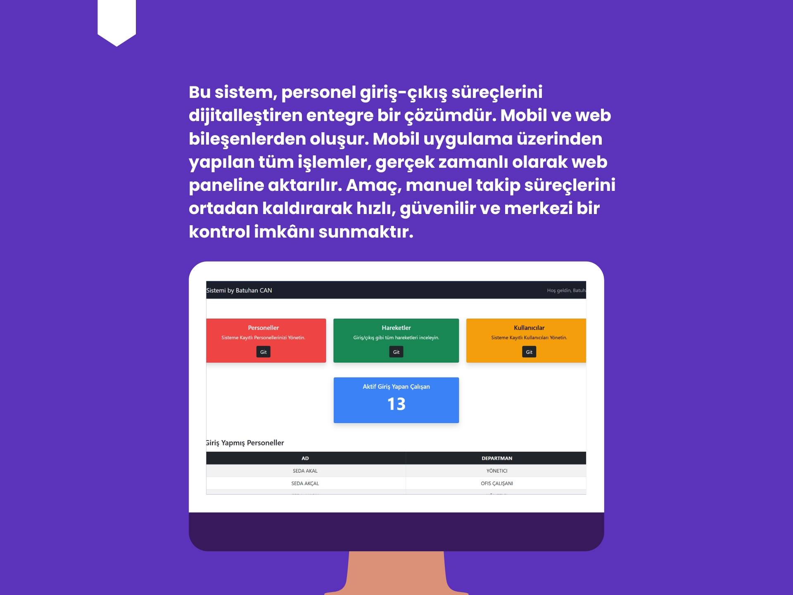
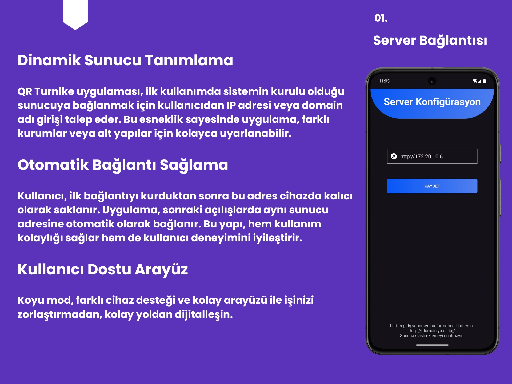
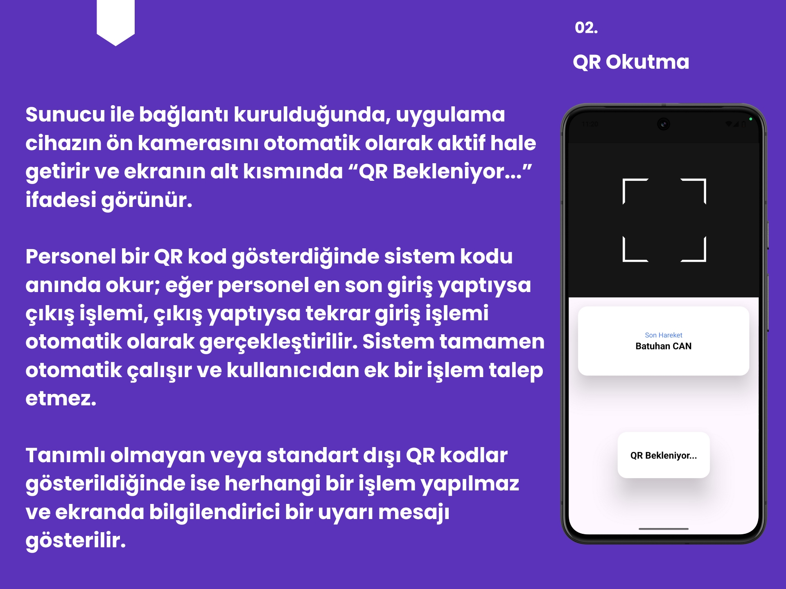
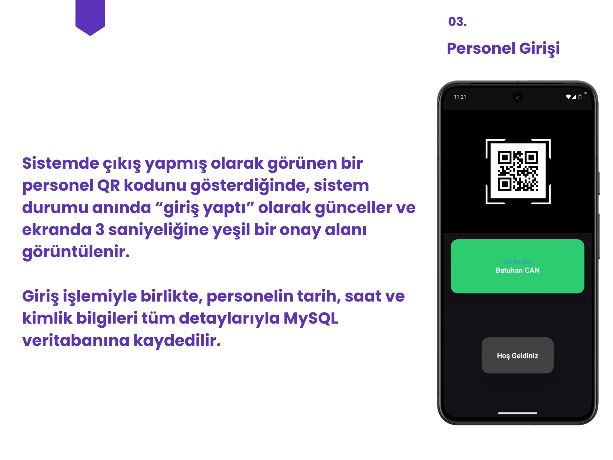
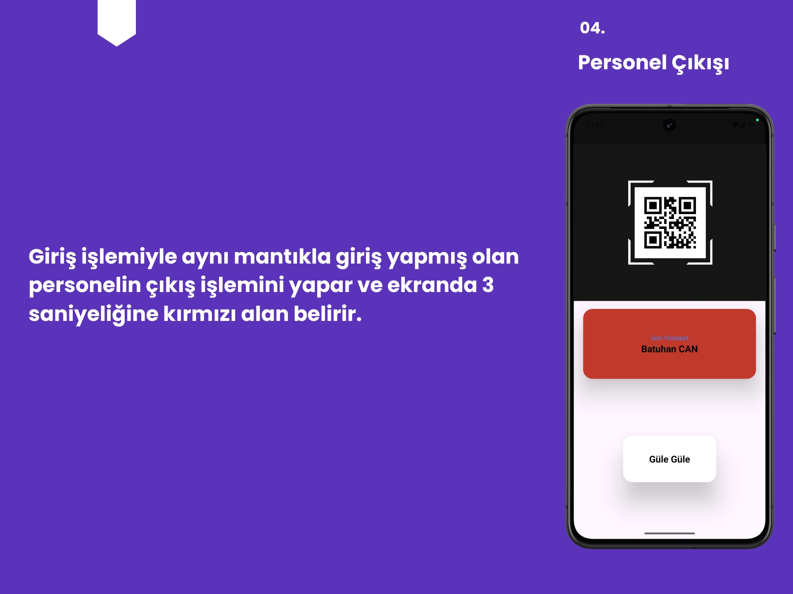
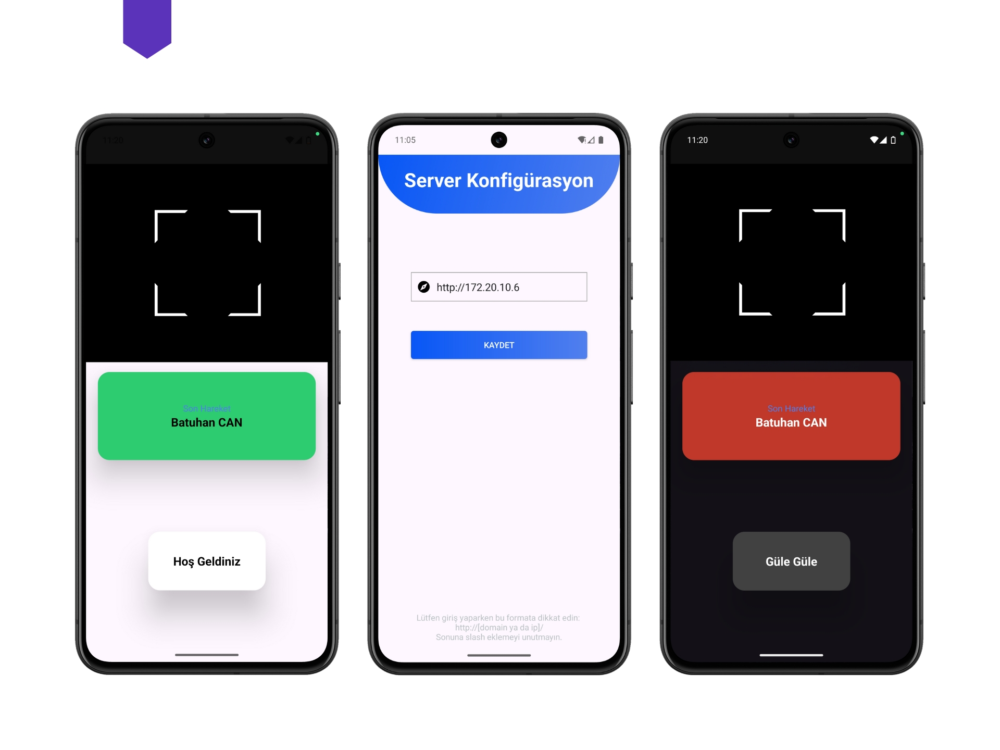

# QR Turnike Personel Takip Sistemi

**QR Turnike**, personel giriş/çıkış işlemlerini mobil cihazlar üzerinden QR kod ile otomatik olarak gerçekleştiren, web tabanlı bir kontrol paneliyle desteklenen entegre bir takip sistemidir.

## 🚀 Proje Bileşenleri

### 📱 Mobil Uygulama
- **Dil**: Kotlin  
- **QR Kod Okuma**: Google ML Kit (Barcode Scanning API)
- **Backend**: PHP WebService (MySQL veritabanı ile)
- **Platform**: Android

#### Özellikler:
- QR kod tarayarak personelin giriş/çıkış işlemlerini otomatik yapar.
- İlk açılışta sunucu IP/domain tanımlanır, sonraki girişlerde otomatik bağlanır.
- Geçerli QR kodlarda giriş/çıkış işlemi ve görsel bildirim (3 saniyelik onay ekranı) sağlanır.
- Tüm işlemler tarih/saat bilgisiyle MySQL veritabanına kaydedilir.
- Standart dışı QR kodlarda işlem yapılmaz, kullanıcı bilgilendirilir.

### 🖥️ Yönetim Paneli (Devam Ediyor)
- **Dil**: ASP.NET Core MVC  
- **Veritabanı**: MySQL  
- **Durum**: Geliştirme aşamasında

#### Planlanan Özellikler:
- Personel, kullanıcı ve yetki yönetimi
- Giriş/çıkış hareketlerini detaylı izleme
- Anlık olarak içeride bulunan personelleri görüntüleme

###### Bu proje; Batuhan CAN tarafından Mersin Üniversitesi Bilişim Sistemleri ve Teknolojileri Bölümü, Bitirme Projesi 2 dersi için geliştirilmiştir.

---

## 📸 Tanıtım Görselleri

<table>
  <tr>
    <td></td>
    <td></td>
  </tr>
  <tr>
    <td></td>
    <td></td>
  </tr>
  <tr>
    <td></td>
    <td></td>
  </tr>
</table>

  

